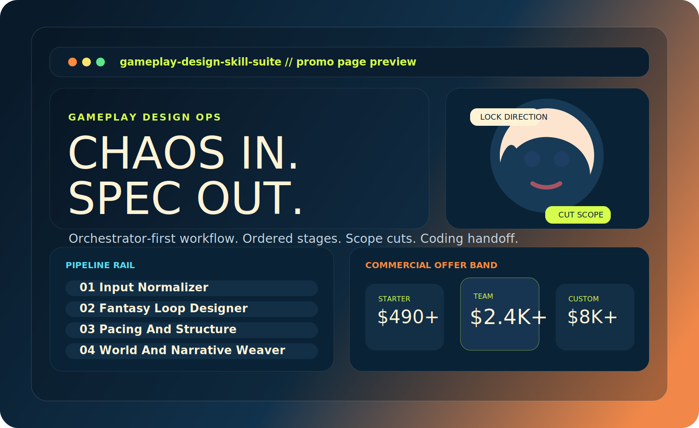

# Gameplay Design Skill Suite

<p align="center">
  
</p>

<p align="center">
  <strong>Orchestrator-first Codex skills for turning raw game ideas into validated gameplay packages, Chinese production-ready game specs, agent-executable execution plans, and dispatch-ready worker packets.</strong>
</p>

<p align="center">
  <a href="README.zh-CN.md">简体中文</a>
  ·
  <a href="docs/faq.md">FAQ</a>
  ·
  <a href="docs/licensing-and-packaging.md">Licensing</a>
  ·
  <a href="docs/pricing-and-commercial-offers.md">Commercial Offers</a>
  ·
  <a href="docs/release-notes-v0.3.0.md">Release Notes</a>
</p>

## What This Is

This repository packages a game-design workflow for Codex around one hard rule:

`gameplay-design-orchestrator` is the only normal upstream entry point.

Instead of exposing ten unrelated prompts and hoping the user manually glues them together, this suite:

- locks direction before system expansion
- drives the gameplay stages in order
- keeps scope discipline visible
- compiles the result into a downstream-ready gameplay package
- expands that package into a full Chinese game spec when needed
- compiles that spec into an execution plan for agent-driven implementation
- includes a first runner prototype for stepping through that execution plan
- includes a dispatch layer that emits stable worker packets instead of pretending to auto-launch agents

The result is not just "better ideation." It is a more reliable bridge from vague concept to structured execution.

## Why This Repo Is Different

Most public prompt packs for game design fail in one of three ways:

| Typical Prompt Pack Failure | What This Suite Does Instead |
| --- | --- |
| Starts with theme, lore, or mechanics soup | Starts with direction lock, player promise, and constraints |
| Treats every prompt as standalone | Treats downstream stages as a controlled chain under the orchestrator |
| Produces pretty but non-executable prose | Produces package structure, registries, spec-ready outputs, and execution-ready task graphs |
| Has no validation | Includes local validators and a real example |
| Expands scope too early | Forces MVP keep/cut decisions before downstream handoff |

## Included Skills

| Skill | Role |
| --- | --- |
| `gameplay-design-orchestrator` | Upstream controller for direction lock, ordered stage execution, and package assembly |
| `gameplay-input-normalizer` | Converts raw input into stable constraints, audience pressure, platform limits, and emotional target |
| `gameplay-fantasy-loop-designer` | Defines player promise, identity fantasy, core action, and loop structure |
| `gameplay-pacing-and-structure` | Designs time-layer pacing, early highs, frustration points, and replay pull |
| `gameplay-world-and-narrative-weaver` | Wraps gameplay in world rule, conflict, and act pressure without replacing the loop spine |
| `gameplay-system-weaver-and-scope-cutter` | Maps systems, resources, MVP keep/cut, and production danger zones |
| `gameplay-coding-handoff-compiler` | Compiles the locked package into scenes, UI, objects, states, variables, and prototype acceptance |
| `game-design-spec` | Expands the mature gameplay package into a full Chinese game design spec and task pack |
| `game-design-execution-compiler` | Compiles the mature spec into `execution-plan.json` and `execution-plan.md` for agent execution |
| `game-design-execution-runner` | Drives one execution-plan task at a time, persists state, prepares bounded worker handoffs or dispatch packets, and enforces a review gate on completion evidence |

For topology details, see [docs/skill-catalog.md](docs/skill-catalog.md).

## Pipeline

```text
Raw game idea
  -> gameplay-design-orchestrator
    -> gameplay-input-normalizer
    -> gameplay-fantasy-loop-designer
    -> gameplay-pacing-and-structure
    -> gameplay-world-and-narrative-weaver
    -> gameplay-system-weaver-and-scope-cutter
    -> gameplay-coding-handoff-compiler
  -> Gameplay Design Package
  -> game-design-spec
  -> Full Chinese Game Design Spec
  -> game-design-execution-compiler
  -> execution-plan.json + execution-plan.md
  -> game-design-execution-runner
  -> execution-run-state.json + worker handoff / dispatch packet
```

Operational rules:

- Do not treat the six downstream `gameplay-*` stage skills as normal free-entry ideation tools.
- Once the formal chain starts, all six downstream stages are mandatory in order.
- Only allow isolated stage revision when a package already exists and the user explicitly requests stage-level rework.

## Proof: Included Example

This repository includes a fully validated gyro-battle web game example:

- Index: [examples/gyro-battle/00-direct-output-index.md](examples/gyro-battle/00-direct-output-index.md)
- Gameplay package: [examples/gyro-battle/final-package/](examples/gyro-battle/final-package/)
- Full spec: [examples/gyro-battle/final-spec/](examples/gyro-battle/final-spec/)
- Execution plan: [examples/gyro-battle/final-execution-plan/](examples/gyro-battle/final-execution-plan/)
- Case study write-up: [docs/gyro-battle-case-study.md](docs/gyro-battle-case-study.md)

The example package includes:

- direction lock between two competing concepts
- loop-back notes from pacing and scope pressure
- a gameplay package with assumption list, system indexes, formulas, and prototype acceptance
- a full spec with system rules, UI tasking, balance tasks, art/audio constraints, QA, and delivery mapping
- an execution plan with small dependency-aware tasks tied back to source refs and canonical IDs
- a runner-ready path that can initialize state, emit worker dispatch packets, and step through tasks in dependency order

This is not a fake sample or a one-page teaser. It is a shipped validation artifact.

## Visual Preview

<p align="center">
  
</p>

The repository root also includes a deployable static promo page:

- [index.html](index.html)
- [styles.css](styles.css)
- [script.js](script.js)
- [vercel.json](vercel.json)

## Who This Is For

- AI-native solo builders making web or lightweight game prototypes
- design operators who want a repeatable game concept pipeline
- small studios that need faster pre-production structure
- teams experimenting with Codex as a design-to-implementation partner
- consultants productizing internal gameplay design workflows

## Commercial Positioning

This repo is intentionally positioned as a source-available showcase and commercialization-ready capability package.

Current public posture:

- public repository for evaluation and discussion
- no open-source redistribution rights granted by default
- commercial usage requires a separate license or engagement path

See:

- [docs/licensing-and-packaging.md](docs/licensing-and-packaging.md)
- [docs/pricing-and-commercial-offers.md](docs/pricing-and-commercial-offers.md)

## Comparison

| Option | Good For | Weakness |
| --- | --- | --- |
| Generic prompt bundle | Quick inspiration | Weak structure, no workflow ownership, easy scope drift |
| Single mega-prompt | Fast experiments | Fragile outputs, hard to revise, no stage accountability |
| This suite | Structured game design plus execution compilation | Requires workflow discipline and works best when followed as designed |

## Installation

1. Check your active `CODEX_HOME`.
2. Copy this repo's `skills/` directory into the active runtime's `skills/`.
3. Restart the Codex session and confirm the skills appear in the available skill list.

If your machine uses both `~/.codex` and `~/.codex-proxy`, install into the actual live runtime path rather than assuming only one Codex home exists.

## Validation

PowerShell:

```powershell
.\scripts\validate-release.ps1
```

Or run the validators individually:

```powershell
python .\skills\gameplay-design-orchestrator\scripts\validate_gameplay_package.py --package-dir .\examples\gyro-battle\final-package
python .\skills\game-design-spec\scripts\validate_spec.py --task-dir .\examples\gyro-battle\final-spec
python .\skills\game-design-execution-compiler\scripts\validate_execution_plan.py --plan-dir .\examples\gyro-battle\final-execution-plan
python .\skills\game-design-execution-runner\scripts\run_execution_plan.py init --plan-dir .\tmp-runner-validation --repo-root . --branch main
```

## Repository Layout

```text
skills/      Core skill suite
examples/    Validated example outputs including execution plans
docs/        Launch copy, FAQ, licensing, pricing, release notes
assets/      README and promo visuals
scripts/     Validation helpers
```

## Read Next

- [README.zh-CN.md](README.zh-CN.md)
- [docs/faq.md](docs/faq.md)
- [docs/gyro-battle-case-study.md](docs/gyro-battle-case-study.md)
- [docs/licensing-and-packaging.md](docs/licensing-and-packaging.md)
- [docs/pricing-and-commercial-offers.md](docs/pricing-and-commercial-offers.md)
- [docs/release-notes-v0.3.0.md](docs/release-notes-v0.3.0.md)

## Status

- Version: `v0.3.0`
- Public repo status: live
- Validation status: included gameplay package, spec, execution plan, and runner smoke path with dispatch artifacts pass local checks
- Business posture: source-available showcase with commercial licensing path
