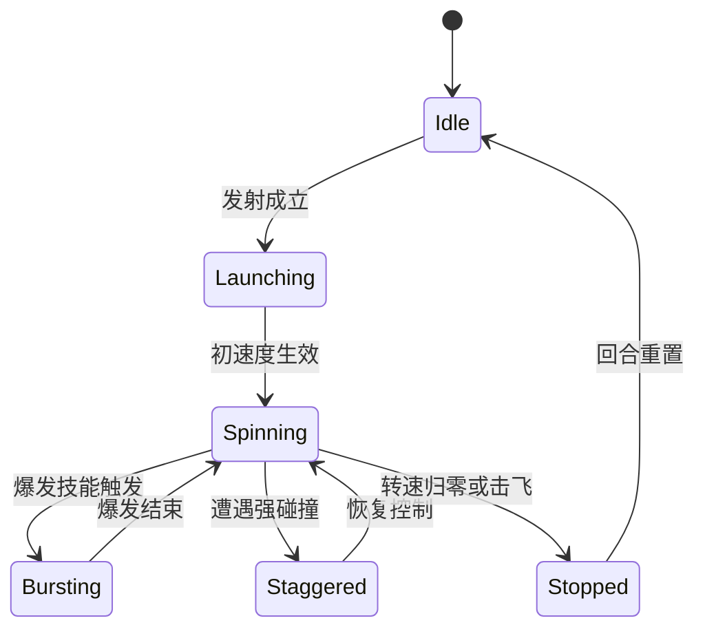

# 项目

- 游戏名：网页端运行的陀螺对战游戏

## 假设清单

- 首发平台为桌面浏览器，目标分辨率 1600x900，键鼠为主。
- 首版目标是本地人机与本地双人对战，不包含联网同步。
- 目标玩家对竞技游戏和短局对战有基础接受度，希望在 3 分钟左右完成一局。
- 项目优先验证碰撞可读性、回合节奏和复盘意愿，而不是长线养成。

## 系统主索引表

| 系统ID | 系统名 | 一句话定位 | 玩家目标 | 核心输入 | 核心输出 | 依赖系统 | 对应UI任务 | 对应数值任务 | 对应配置表 | 对应测试重点 |
|---|---|---|---|---|---|---|---|---|---|---|
| SYS-01 | 发射与碰撞系统 | 定义发射、位移、碰撞和击退 | 在开局与对撞时争夺主动权 | 鼠标拖拽、发射释放、冲刺键 | 位置变化、碰撞力度、击退向量 | 无 | 04-ui-task.md | 06-balance-task.md | CFG-01 | 发射手感、碰撞可读性 |
| SYS-02 | 转速与耐久系统 | 把资源消耗转成胜负压力 | 管理风险，不在无效碰撞中亏资源 | 时间流逝、碰撞结果、技能消耗 | 转速衰减、耐久损失、停转状态 | SYS-01 | 04-ui-task.md | 06-balance-task.md | CFG-01 | 资源衰减节奏 |
| SYS-03 | 爆发与技能系统 | 提供高光时刻和逆转窗口 | 抢爆发时机，形成回合节奏反转 | 技能按钮、碰撞命中、中心区控制 | 爆发条增长、技能效果、冷却 | SYS-01, SYS-02 | 04-ui-task.md | 06-balance-task.md | CFG-02 | 爆发节奏、冷却公平性 |
| SYS-04 | 竞技场与回合规则系统 | 管理场地风险、回合结算与整局胜负 | 利用地形与比分机制稳定拿下整局 | 场地边界、危险区、时间耗尽 | 击飞判定、回合结束、比分变化 | SYS-01, SYS-02 | 05-level-task.md | 06-balance-task.md | CFG-03 | 击飞判定、回合切换 |

## 资源主索引表

| 资源ID | 资源名 | 类型 | 主要来源系统ID | 主要去向系统ID | 是否稀缺 |
|---|---|---|---|---|---|
| RES-01 | 转速值 | 数值 | SYS-02 | SYS-02 | 是 |
| RES-02 | 爆发条 | 数值 | SYS-03 | SYS-03 | 是 |
| RES-03 | 耐久值 | 数值 | SYS-02 | SYS-02 | 是 |

## 公式主索引表

| 公式ID | 公式名 | 所属系统ID | 输入变量 | 输出结果 | 对应章节 |
|---|---|---|---|---|---|
| FML-01 | 碰撞伤害公式 | SYS-02 | VAR-01, VAR-02 | 耐久损失值 | 6 |
| FML-02 | 爆发条增长公式 | SYS-03 | VAR-01, VAR-03 | 爆发条增长值 | 6 |
| FML-03 | 击飞判定公式 | SYS-04 | VAR-02, VAR-04 | 是否击飞 | 6 |

## 配置表主索引表

| 表ID | 表名 | 所属系统ID | 主键 | 主要用途 | 热更支持 |
|---|---|---|---|---|---|
| CFG-01 | top_parts_config | SYS-01 | part_id | 配置模板速度、重量、稳定性 | 是 |
| CFG-02 | skill_profile_config | SYS-03 | skill_id | 配置技能效果、冷却、爆发消耗 | 是 |
| CFG-03 | arena_rule_config | SYS-04 | arena_id | 配置场地大小、危险区、回合时长 | 是 |

## 变量主索引表

| 变量ID | 变量名 | 所属公式ID | 单位 | 主要来源 | 主要去向 |
|---|---|---|---|---|---|
| VAR-01 | collision_speed | FML-01 | force_unit | SYS-01 | FML-01, FML-02 |
| VAR-02 | stability_rating | FML-01 | point | CFG-01 | FML-01, FML-03 |
| VAR-03 | center_control_bonus | FML-02 | point | SYS-04 | FML-02 |
| VAR-04 | knockback_vector | FML-03 | force_unit | SYS-01 | FML-03 |

# 1. 游戏概述

## 1.1 题材与美术风格
近未来地下竞技场、荧光灯管、金属竞技环、强对比色 HUD。整体风格强调“街头竞技 + 可读电子竞技反馈”，避免写实油腻材质。
## 1.2 游戏名
网页端运行的陀螺对战游戏
## 1.3 游戏类型
短局竞技、物理碰撞对战、轻技能博弈网页游戏

## 1.4 平台
桌面浏览器 Web 优先，Chrome/Edge 为首发目标。

## 1.5 核心玩法概述

### 一句话卖点
3 分钟内打完一局、用操作与时机把对手陀螺精准撞出竞技环。

### 核心游戏循环
选模板 -> 发射陀螺 -> 抢中心区与能量 -> 冲刺或释放技能 -> 造成耐久/转速压制 -> 击飞或停转取胜 -> 回合复盘。

### 基础循环
拖拽瞄准与蓄力、判断碰撞角度、避开边缘、维持转速。

### 扩展循环
通过爆发条积累触发专属技能，改变碰撞权重、位移节奏或场地压制方式。

### 长期循环
围绕不同模板与竞技场差异做操作熟练度提升，而不是围绕重经济系统做数值堆叠。

### 玩家成长路径
从“能完成有效发射”成长到“能预判对手走位并利用场地达成击飞”。

### 失败与复盘机制
每个回合结束都展示失败原因：击飞、耐久耗尽、停转或时间判负，并提示最后一次关键碰撞的方向与时机。

## 1.6 Camera
固定俯视偏斜视角，战斗中不旋转镜头，保证边界和方向判断稳定。

## 1.7 Controls
鼠标拖拽控制发射角与蓄力，空格触发冲刺，Q 触发技能，Esc 暂停。

## 1.8 Audience
偏竞技休闲玩家、喜欢短局 PvP/PvE 对战、对贝类陀螺或弹球碰撞爽感有兴趣的网页玩家。

## 1.9 Session Length And Pacing
单回合 35-55 秒，整局三回合两胜控制在 2 分 30 秒到 4 分钟。

## 1.10 Save Model
本地存档，仅保存模板偏好、基础设置和人机解锁。
## 1.11 Monetization
首版不做商业化验证，默认免费原型。
## 1.12 Tech Stack
HTML5 Canvas + JavaScript 游戏循环，简单刚体近似而非完整物理引擎。
## 1.13 Minimum Device Target
近 3 年主流办公笔记本，集显环境稳定 60 FPS。
# 2. 系统框架设计

## 2.1 系统总览
SYS-01 负责可操作碰撞，SYS-02 把碰撞后果转成资源损耗，SYS-03 提供节奏高光，SYS-04 负责回合切分与地形压力。四个系统共同保证短局竞技闭环。

## 2.2 系统间关联与依赖
SYS-01 是所有即时行为的输入源；SYS-02 与 SYS-03 共同把碰撞行为转为资源变化和技能窗口；SYS-04 对 SYS-01 的空间结果进行规则判定，并向比分与回合流程回写状态。

# 3. 分系统规则
## 3.1 系统 SYS-01

### 设计目的
让玩家感觉自己在操控对撞节奏，而不是旁观随机物理。

### 用户维度

| 项 | 内容 |
|---|---|
| 玩家目标 | 抢到更优碰撞角并制造击退 |
| 进入条件 | 回合开始后完成发射 |
| 退出条件 | 回合结束或陀螺停转 |
| 核心乐趣 | 精准切角、反撞、借边压制 |
| 失败代价 | 被对手拿到位置与节奏 |
| 复盘收益 | 看懂角度、力量与轨迹失误 |

### 关键名词定义

| 名词 | 定义 | 与其他名词边界 |
|---|---|---|
| 有效碰撞 | 能造成明显击退或资源变化的碰撞 | 不是轻微擦边 |
| 冲刺窗口 | 可用短位移主动改线的瞬间 | 不等于技能释放 |

### 规则ID

| 规则ID | 触发条件 | 玩家动作 | 系统处理 | 反馈 | 奖励/惩罚 | 备注 |
|---|---|---|---|---|---|---|
| SYS-01-R01 | 回合开始 | 拖拽并释放 | 生成初始速度与角速度 | 方向线、蓄力火花 | 开局主动权 | 发射手感必须稳定 |
| SYS-01-R02 | 冲刺冷却结束 | 按空格 | 施加短时加速并改变轨迹 | 拖尾与音效 | 抢角成功 | 误用会冲向危险区 |
| SYS-01-R03 | 发生碰撞 | 持续走位 | 计算击退向量与碰撞强度 | 火花、震屏、击退 | 打开连击窗口 | 结果需可读 |

### 边界条件、异常与极端输入

| 场景 | 输入 | 期望结果 | 兜底处理 |
|---|---|---|---|
| 玩家发射角极短 | 极小拖拽 | 仍能发射，但初速偏低 | 自动补最小发射阈值 |
| 双方同帧冲刺碰撞 | 同时冲刺 | 正常结算优先级，不闪退 | 以质量和角速度做结算 |
| 贴边连续摩擦 | 边缘卡角 | 能脱离或被判危险 | 加入边界弹离修正 |

### 状态机

### 反滥用与防刷

| 风险 | 触发方式 | 限制手段 | 对正常玩家影响 |
|---|---|---|---|
| 无限绕边拖时间 | 贴边低风险耗时间 | 边缘危险区逐步增强 | 迫使回到中心区 |
| 冲刺连点 | 利用输入堆叠穿模 | 固定冷却与输入锁 | 影响很低 |

## 3.2 可重复游玩设计
不同模板、不同 arena 危险区、不同技能节奏共同构成复玩动力。玩家重复游玩时追求的是更稳定的回合胜率与更漂亮的击飞终结，而不是刷材料。
## 版本号与日期

- 版本号：0.1
- 日期：2026-04-15
## 变更清单（新增/修改/移除）
| 类型 | 内容 | 影响章节 |
|---|---|---|
| 新增 | 陀螺对战 master spec 初版 | 1-11 |

## 与上一版的差异对比

| 章节 | 规则变化 | 数值变化 | UI变化 | 配置变化 |
|---|---|---|---|---|
| 1 | 初版建立 | 初版建立 | 初版建立 | 初版建立 |

## 自检结论

- 是否满足“不得省略”：是
- 是否满足“不得以示例代替”：是
- 仍需补强的章节：无
